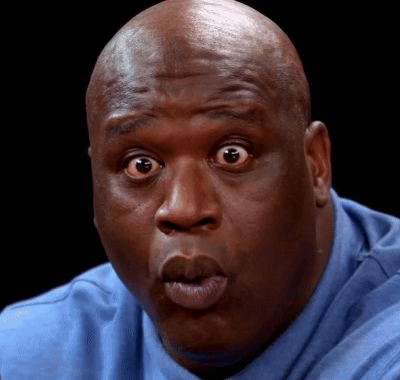
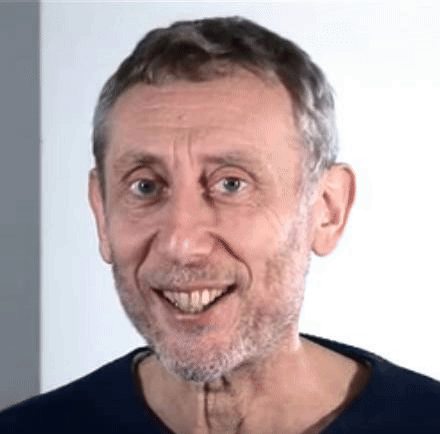
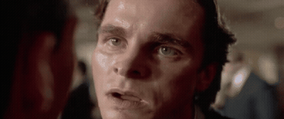
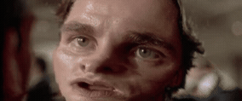
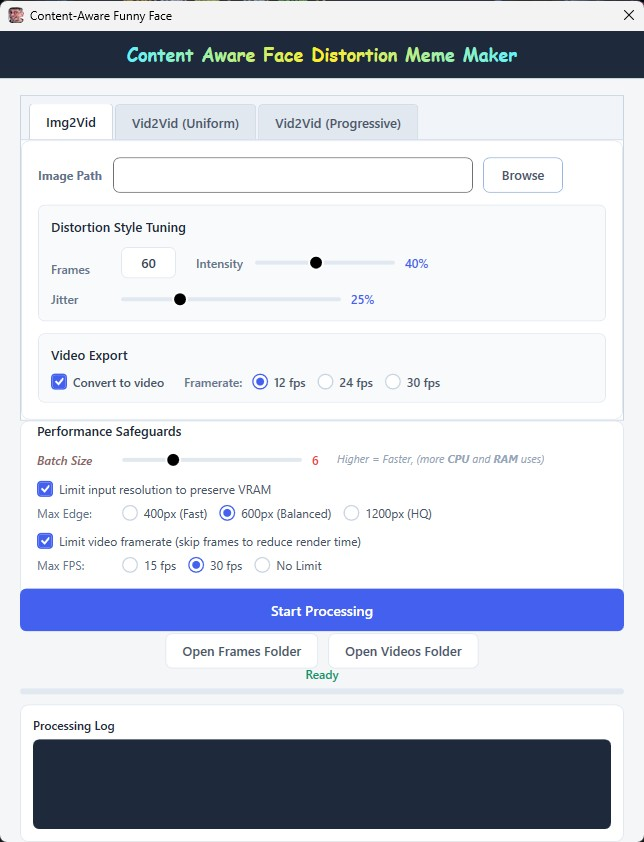

<h1 align="center"> Content Aware Funny Face Meme Generator </h1>

  
  
  
  
  
  

## GPU-accelerated, multi-threaded content-aware scaling engine for creating distorted meme videos.

 
   
   
  

---

*Download the latest standalone build from the **[Releases](https://github.com/Panicdisress/seam-carving-meme-generator/releases)** page.*
---

### ✨ Key Features

* **⚡ GPU-Accelerated** – 10-20x faster than *Photoshop script method*.
* **🎯 Content-Aware** – Intelligent seam carving algorithm that preserves important image details.
* **🫠Facial Recognition** - Targets face for funny look.
* **🌀 Customizable Chaos** – Adjust **Jitter** and **seed** for unique, glitchy effects.
* **🎬 Built-in Video Export** – Integrated FFmpeg support to convert frames to MP4 instantly.
* **🖥️ User-Friendly GUI** – Simple Tkinter-based interface; no coding required to run.

---

### 🎛️ The 3 Rendering Modes (Tabs)

The engine is split into three distinct tabs, each designed for a specific meme format:

1. **📸 Img2Vid (Image to Video)**
   * Takes a single static image and animates it into a video. The engine incrementally carves the image frame by frame, creating a smooth "melting" animation over time.
2. **📼 Vid2Vid (Uniform)**
   * Takes an input video and applies the *exact same* amount of distortion to every single frame. Perfect for creating a constant, glitchy, and chaotic look throughout the entire clip.
3. **📈 Vid2Vid (Progressive)**
   * Takes an input video and smoothly ramps the distortion from 0% at the start to your target intensity at the very end. This creates the classic escalating "slow melt" or "black hole" effect.

---

| 10% Intensity | 30% intensity |
| :---: | :---: |
|  |  |
| **Face bias -50** | **Face bias -50** |

| 30% Intensity | 45% intensity |
| :---: | :---: |
|  |  |
| **Face bias -55** | **Face bias -25** |

*Generation is so fast that my old laptop having i5 10th gen and 4gb vram takes ~20-30 Sec. to render these with 6 batch size.*

---

## Fully 📸functional UI with inbuild video conversion.⬇️

  

---

---

## 🎛️ Parameter Guide
* **Img2Vid**

| Parameter | Type | Default | Description |
| :--- | :--- | :--- | :--- |
| **Frames** | Integer | `60` | Total number of frames to generate for the animation sequence. |
| **Intensity** | Percentge | `40%` | The total amount of image width/height to carve away (10% to 80%). Higher = intense squish. |
| **Jitter** | Percentage | `25%` | Injects random noise into the energy map to create a chaotic, shaking, or boiling effect. |
| **Framerate** | FPS | `12` | The playback speed of the exported MP4 video. |

* **vid2vid (Uniform)**
 
| Parameter | Type | Default | Description |
| :--- | :--- | :--- | :--- |
| Seed | Integer | `42` | Injects random noise into the algorithm for a glitchy, unstable visual effect. |
| Face Bias | Integer | `-50` | Directs the algorithm using facial recognition. -ve value effect more on face. +ve value protect face. |

* **vid2vid (Progressive)**
  
| Parameter | Type | Default | Description |
| :--- | :--- | :--- | :--- |
| Max intensity | Percentage | `40%` | Peak distortion that the video will reach on its final frame. |

---

### ⚠️ Performance Safeguards & Hardware Limits
Video seam carving is highly demanding. The application includes a "Performance Safeguards" block to prevent system crashes during heavy workloads:

* **🔥 The Batch Size Slider (Crucial!)**
  * This controls how many frames are processed simultaneously across your CPU threads and GPU VRAM. 
  * **1 to 3:** Safe mode. Best for systems with limited RAM.
  * **4 to 8:** The sweet spot for standard modern multi-core PCs.
  * **10 to 20:** Maximum overdrive. Only use this if you have a high-core CPU and 8GB+ of VRAM. **If the app crashes or your PC freezes, lower this slider!**
* **Max Edge (Resolution Limit):** Automatically downscales media if the longest edge exceeds 600px/1200px. Standardizing the resolution keeps the dynamic programming math lightning fast.
* **Max FPS:** Decimates 60fps videos down to 30fps or 15fps before processing to slash redundant frame rendering times.

---

### 💡 Pro-Tips for Best Results

* `Ignore Performance safeguard in img2img mode.` **Only batch size is relevant**
* **For Smooth Warping:** Keep `Jitter` at 0.
* **Resolution Tip:** For the fastest performance, use source images with a width under **600px**.
* **Preview Buttons** before doing heavy lifting of full animation render you can just preview frame results in both vid2vid methods.

### 📏 Image Size:
* `<= 600px`: lightning fast⚡
* `600-1200px`: fast generation ✓
* `> 1200px`: slow 🐌

---
### ⚙️ Installation from Source (For Developers)
If you are compiling this project from source in Visual Studio, you must provide your own FFmpeg executable:
1. Download the latest Windows essentials build from [gyan.dev](https://www.gyan.dev/ffmpeg/builds/ffmpeg-release-essentials.zip).
2. Extract the zip file, navigate into the `ffmpeg` folder, and paste `ffmpeg.exe`.
3. Make sure to select `Copy to output directory` on *Solution Explorer* in `Visual Studio`.

### 🛠️ Libraires:

* **OpenCV**: Image manipulation and frame handling.
* **ILGPU**: CUDA/OpenCL wrapper for raw GPU tensor and energy map processing.
* **FFmpeg**: Backend for high-quality video encoding.

---

## 🤖 AI Development Note
*I am not a coder. I don’t claim to be one, nor do I have the professional skillset. I am simply an enthusiast. I use AI to achieve my goals. Because I have a foundation in basic coding from school and college, I understand the logic well enough to guide AI models and steer them to fulfill my tasks. This project is the result of that partnership.*

* **AI Contributions:** Optimization (Algorithm refactoring and CUDA memory management), Debugging, Documentation, and Fine-Tuning.
* **Human Oversight:** Core algorithm logic direction, UI design, rigorous local hardware benchmarking, and validation.
---

## 🔧 Troubleshooting

### ❌ Slow Performance
* **Resolution:** High-res images (2K,4K+) scale exponentially in processing time.
* **Crash:** Batch is an very sensitive slider. Start with default then crank looking at taskbar.

---
